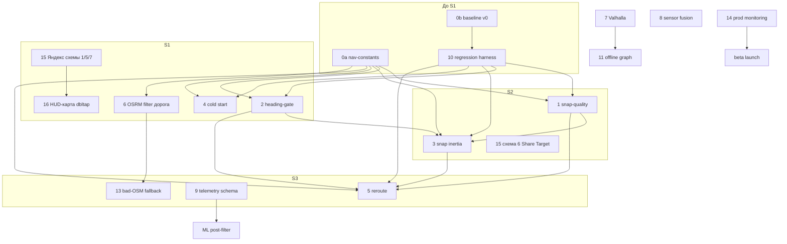

# План улучшения навигации Мото ИЛС — ревизия v3

> Живой документ. Предыдущая ревизия: v2 (2026-07-07).  
> v3 добавляет **направления 15–16** (Яндекс как источник маршрутов, HUD↔карта), обновляет приоритеты, дорожную карту M1, метрики M6, риски и out-of-scope.  
> Направления **1–14** из v2 **не переписываются** — см. ниже без изменений по сути.

Ответ на ревью v2: приняты правки по порогам, LOST-UX, reroute-триггеру, инфраструктуре Valhalla, ML-объёму и четыре структурных блока (baseline, harness, out-of-scope, риски). **Реализовано в коде (S0–S3):** `nav-constants.js`, `snap-quality.js`, `gps-converge.js`, `maneuver-filter.js`, `offroute.js`, harness `nav-replay.mjs`.

---

## 0. Преамбула: что делаем до S1

| Шаг | Содержание | Срок | Блокирует |
|-----|------------|------|-----------|
| **0a** | `nav-constants.js` — все пороги с комментариями «что / почему» | 1 вечер | A/B, спринты 1–5 |
| **0b** | **Baseline v0** — прогон 5 эталонных треков, `baseline_v0.json` | 1 вечер | любые заявления «стало лучше» |
| **0c** | **Harness (№10)** — replay JSONL/GPX → diff метрик vs baseline | 2–3 вечера | S1–S5 |

**Эталонные треки baseline:** `telemetry_2026-07-06_19-33`, `telemetry_2026-07-07_07-07` + 3 новые (город, трасса, серпантин). Метрики: p50/p95 `lat_off`, jump count, доля LOST/DEGRADED, reroute/100 км, phantom marks.

**Ресурсный контекст:** план рассчитан на **1 разработчика ~15 ч/нед** (вечера). Full-time сроки в таблицах ниже — делить на ~2.5.

---

## Граф зависимостей



**Правило:** №3 без №1; №5 без №2+№3; beta без №14. **№15 схемы 1/5/7** и **№16** — без зависимостей от snap/Valhalla.

---

## Приоритизация (обновлённая, v3)

| № | Направление | Эффект | Трудозатраты | Риск | Backend | Зависимости |
|---|-------------|--------|--------------|------|---------|-------------|
| **10** | Regression harness | Критичен (методология) | 2–3 вечера | Низкий | Нет | 0b |
| **6** | OSRM filter + highway | Высокий | 0.5–1 день (доработка) | Низкий | Нет | готово |
| **2** | Heading-gate 45°/90° | Высокий | 1 вечер | Низкий | Нет | constants |
| **4** | Cold start (5 fix) | Средний | 1 вечер | Низкий | Нет | constants |
| **1** | Snap-quality + curvature | Высокий | 2 вечера | Средний | Нет | 2, constants |
| **3** | Snap inertia | Высокий | 1–2 вечера | Средний | Нет | **1, 2** |
| **5** | Reroute (конъюнкция) | Средний | 1–2 вечера | Средний | Нет | **2, 3, 1** |
| **13** | Плохой OSM → компас-режим | Средний | 1 вечер | Низкий | Нет | 6 |
| **15** | **Интеграция с Яндексом (маршруты)** | **Очень высокий (РФ)** | **2–3 вечера** (сх. 1/5/7) + **1–2 дня** (сх. 6) | **Низкий** (1/5/7), **средний** (6) | Нет (redirect follow) | — |
| **16** | **Переключение HUD↔карта (dbltap)** | **Высокий (UX)** | **2–3 вечера** | **Низкий** | Нет | Leaflet, `route.coords` |
| **9** | Telemetry + GDPR | Долгий | 2–3 вечера + юрист | Средний | Upload API | — |
| **14** | Prod monitoring | Высокий (beta) | 1 неделя | Низкий | Да (миним.) | 9 |
| **7** | Valhalla + trace | Очень высокий | 3–5 нед | Высокий | **Да** | fallback |
| **8** | Sensor fusion | Средний–высокий | PWA 3 веч / native 2 нед | Средний | Нет | — |
| **12** | Battery | Средний | 1–2 недели | Низкий | Нет | — |
| **11** | Offline Valhalla mobile | Высокий (ниша) | 4–6 нед | Высокий | Нет (on-device) | 7, Capacitor |

> **Стратегическое (вне v3, M4–M6):** официальный **ymaps3 JavaScript API** с коммерческим ключом Яндекса — отдельное направление, требует договора и бюджета **от десятков тысяч ₽/мес**. Не смешивать с №15.

---

## Направление 1 — Snap-quality (ревизия)

**Проблема:** При плохом GPS HUD продолжает двигать `s0` и переключать манёвры, хотя позиция на маршруте недостоверна.

**Решение:**

```
score = lateral / max(acc, 5)

// Curvature-aware (радиус < 30 м → K = 1/R > 0.033)
if radiusAtS(geom, s) < 30:
  scoreThresholds *= 1.5   // не уходить в DEGRADED на дуге

// Гистерезис + временная устойчивость
state changes only if 2 of last 3 ticks satisfy condition OR held ≥ 1.5 s

GOOD:     score ≤ 1.2
DEGRADED: score ≤ 2.5 (вход), → GOOD при score ≤ 1.0
LOST:     score > 2.5 OR lateral > 80 m
          → DEGRADED при score ≤ 2.0 AND lateral < 60 m

jump (|Δs0|>50): force DEGRADED 3 s

DEGRADED timeout: if > 30 s → force re-eval with expanded window (±3·acc + 100 m)
```

**UI (исправлено по ревью):**

| Состояние | s0 | Манёвры | Дорожка | Стрелка |
|-----------|-----|---------|---------|---------|
| GOOD | обновляется | полный HUD | да | `findNextManeuver` |
| DEGRADED | **заморожен** | последний `nm`, без переключения | да | последняя стрелка + скорость |
| LOST | не обновлять | скрыть дистанцию | **скрыть** | **«GPS потерян»** (не компас на финиш); мелкий справочный компас опционально |

**Функции:** `snap-quality.js`; `snapToRoute`, `getNavSnap`, `hud.onTick`, `render.js`, `telemetry.logSnapFromResult`.

**Эффект:** 07-07 (288× lat_off>30 м); метка №4 (683 м).

**Трудозатраты:** 14–18 ч.

**Критерии успеха (vs baseline v0):**

| Метрика | Baseline 07-07 | Цель |
|---------|------------------|------|
| Доля тиков LOST при acc<15 м | — | <2% |
| Phantom mark при lat_off<10 м | 2/4 | 0 |
| Мигания GOOD↔DEGRADED / мин | — | <3 |

---

## Направление 2 — Heading-gate (ревизия)

**Проблема:** Snap перескакивает на параллельный/встречный сегмент при геометрически меньшем lateral.

**Решение — двухуровневый gate:**

```
dot = cos(angleDiff(tangent, heading))
moveVec = bearing from prev fix to current (if spd > 1 m/s)

ACCEPT_GOOD:  angleDiff ≤ 45° AND dot ≥ cos(45°) ≈ 0.71
              AND dot(moveVec, tangent) > 0 (не едем назад по сегменту)

REJECT_ANY:   angleDiff > 90° → кандидат отбрасывается всегда

При acc > 25 м OR headingAge > 3 s: только REJECT_ANY (90°), ACCEPT смягчён
```

**Функции:** `scanSnap`, `snapToRoute` (`route-geometry.js`); `fuseHeading` / `S.smoothedHeading` (`heading.js`).

**Критерии:** jump при spd>10 м/с и стабильном hdg — с 8 до ≤2 за поездку.

---

## Направление 3 — Инерция snap (ревизия)

**Проблема:** Фиксированное окно ±150 м позволяет топологически неверный скачок за один тик.

**Решение:**

```
Δt = min(2.0, now - prevFixTs)
sWindow = v·Δt + 3·acc + 10

score = lateral + SNAP_ANGLE_PENALTY · (1 - dot) · 50
      + SNAP_JUMP_PENALTY · max(0, |s - prevS| - v·Δt - acc) / 10
```

**Критерии:** p95 |Δs0| при spd>5 м/с — с ~90 м до <35 м.

---

## Направление 4 — Холодный старт (ревизия)

**Проблема:** HUD валиден с первого fix с acc 44 м и network-кэшем.

**Решение:** 5 fixes, last-3 acc<15 м, reject network provider, re-converge после LOST>60 с.

**Критерии:** lat_off на первом манёвре — с 44 м до <15 м.

---

## Направление 5 — Reroute на скорости (ревизия)

**Проблема:** Reroute сбрасывает `s0` и срабатывает ложно на развязках.

**Решение:** конъюнктивный триггер (lateral + dist + heading + snap quality); seed `newS0` после OSRM.

**Критерии:** |Δs0| после reroute при spd>20 м/с — с >10000 м до <150 м.

---

## Направление 6 — OSRM filter (ревизия)

**Уже сделано:** `maneuver-filter.js`. Пороги по highway, `maneuver_filtered` telemetry с дедупликацией.

---

## Направление 7 — Valhalla (ревизия)

**Проблема:** OSRM не даёт качественных манёвров и HMM map-matching.

**Решение:** `getRouter()` valhalla → OSRM fallback → OFFLINE_GUIDE; trace 25 точек / 2 с.

**Трудозатраты:** 3–5 нед.

---

## Направление 8 — Sensor fusion (ревизия)

**Решение:** PWA `α(spd) = clamp(0.02 + spd/25, …)`; Capacitor Madgwick + gyro.

---

## Направление 9 — Telemetry / ML (ревизия)

Mark с тегами `phantom_turn`; GDPR opt-in; ML 1500–2000 поездок.

---

## Направление 10 — Regression harness

`scripts/nav-replay.mjs`; `npm run nav:test`; diff vs `baseline_v0.json`.

---

## Направление 11 — Offline Valhalla (M4–M5)

Региональный граф 300–800 MB; маршрут и trace офлайн.

---

## Направление 12 — Battery (M4–M5)

Адаптивный GPS 0.5–2 Hz; skip `renderPathway` при Δs<2 м и GOOD; цель ≤8%/ч.

---

## Направление 13 — Плохой OSM fallback (M2–M3)

`routeQualityScore` → compass mode на финиш без snap/манёвров.

---

## Направление 14 — Production monitoring (до beta)

Batch upload opt-in → Grafana: p50/p95 lat_off, %LOST, reroute/100 km.

---

## Направление 15 — Интеграция с Яндексом как источник маршрутов

**Проблема:** Пользователи уже строят маршруты в Яндекс.Картах (пробки, привычный поиск), но хотят вести поездку в Мото ИЛС (HUD, голос, камеры, офлайн-кеш).

**Общий принцип:** извлекаем только **waypoints из URL** (параметр `rtext`, раскрытие short-link). **Парсинг HTML** страниц `yandex.ru/maps` **запрещён ToS и не используется**. Геометрию между точками строит **наш** OSRM/Valhalla.

**Out-of-scope направления 15 (жёстко):**

- Парсинг HTML `yandex.ru/maps`
- Эмуляция закрытых API Яндекс.Навигатора
- Извлечение steps из работающего в фоне Яндекс.Навигатора
- Пробки / live traffic в нашем движке (только в Яндексе при планировании)

---

### Схема 15.1 — Приём ссылки Яндекс.Карт как источника waypoints

**Формулировка:** Пользователь копирует ссылку «Поделиться» из Яндекс.Карт; приложение извлекает список точек и строит маршрут своим роутером.

**Решение:**

1. Разбор длинной ссылки: query-параметр `rtext` — точки через `~` (`lat,lon` или адреса).
2. Короткая ссылка `yandex.ru/maps/-/…` или `yandex.ru/maps/?…` — **HTTP follow-redirect** (без HTML), затем разбор финального URL.
3. Waypoints → `buildRoute` / multi-waypoint OSRM: `lon,lat;lon,lat;…`
4. UX-подсказка при вставке: *«Для точного повторения геометрии Яндекса добавляйте промежуточные точки каждые 3–5 км — иначе наш роутер может выбрать другие дороги»*.

**Эффект:** Снижение трения «построил в Яндексе → еду в Мото ИЛС»; рост конверсии бета для РФ.

**Трудозатраты:** 1 вечер (парсер + поле в setup + тесты на 10 ссылках).

**Псевдокод:**

```javascript
// js/yandex-link.js
const SHORT_RE = /^https?:\/\/(yandex\.ru|ya\.ru)\/maps\/-/;
const RTEXT_RE = /[?&]rtext=([^&]+)/;

async function parseYandexRouteLink(rawUrl){
  let url = rawUrl.trim();
  if(SHORT_RE.test(url)){
    const res = await fetch(url, { redirect: 'follow', method: 'HEAD' });
    url = res.url;
  }
  const m = url.match(RTEXT_RE);
  if(!m) throw new Error('Нет rtext в ссылке Яндекс.Карт');
  const parts = decodeURIComponent(m[1]).split('~');
  return parts.map(parseRtextPoint).filter(Boolean);
  // parseRtextPoint: "55.75,37.62" → {lat,lon} | геокод адреса — опционально Nominatim
}
```

**Критерии успеха:**

| Метрика | Цель |
|---------|------|
| Доля маршрутов, где полилиния совпадает с Яндексом в пределах **200 м** на всём протяжении | **≥80%** при плотности waypoints **раз в 3 км** |
| Успешный разбор валидных ссылок из фикстур (10+ актуальных URL) | **100%** |

---

### Схема 15.5 — Гибрид: планирование Яндекс, ведение наше

**Формулировка:** Расширение 15.1 — после разбора waypoints пользователь выбирает режим старта.

**Решение:**

Диалог с двумя вариантами:

| Вариант | Поведение |
|---------|-----------|
| **Быстрый старт** | Waypoints как есть, прямые отрезки между точками (временная polyline), HUD сразу |
| **Пересчёт движком** | OSRM/Valhalla между waypoints, корректные манёвры, кеш для офлайн |

**История маршрутов:** IndexedDB (`yandex-imports` store): обезличенное имя, timestamp, waypoints, выбранный режим.

**Эффект:** Мгновенный старт на остановке + качественная геометрия по желанию.

**Трудозатраты:** 1 вечер (диалог + IndexedDB + экран истории).

**Псевдокод:**

```javascript
async function saveYandexImportHistory(waypoints, mode){
  const name = (waypoints[0]?.label || 'Маршрут').split(/\s+/)[0];
  await idbPut('yandex-imports', {
    id: crypto.randomUUID(),
    name,
    ts: Date.now(),
    mode,           // 'direct' | 'routed'
    waypointCount: waypoints.length
  });
}
```

**Критерии успеха:**

| Метрика | Цель |
|---------|------|
| Время от вставки ссылки до старта навигации (медиана) | **<15 с** |

---

### Схема 15.6 — Web Share Target (Поделиться → Moto HUD)

**Формулировка:** Из Яндекс.Карт «Поделиться» → выбор Moto HUD в системном шите.

**Решение — PWA (`manifest.json`):**

```json
"share_target": {
  "action": "/",
  "method": "GET",
  "params": {
    "url": "shared_url",
    "text": "shared_text"
  }
}
```

При загрузке: если `?shared_url=` или `?shared_text=` содержит ссылку Яндекс.Карт → баннер **«Использовать этот маршрут?»** [Да] [Нет] → `parseYandexRouteLink`.

**Требования:** PWA установлена через **Add to Home Screen** (Android). **iOS Safari не поддерживает Web Share Target.**

**Capacitor (Android):** `AndroidManifest.xml` — intent-filter `ACTION_SEND`, `mimeType text/plain`; в `MainActivity` передать `intent.getStringExtra(Intent.EXTRA_TEXT)` в WebView (`window.__sharedYandexUrl`).

**Эффект:** Минимум действий: Share → Moto HUD (без копипаста).

**Трудозатраты:** 1–2 дня (manifest + Capacitor intent + тесты на 3+ устройствах).

**Критерии успеха:**

| Метрика | Цель |
|---------|------|
| Доля пользователей бета, использующих Share Target хотя бы раз за месяц | **>40%** |

---

### Схема 15.7 — Автомониторинг буфера обмена

**Формулировка:** Расширение кнопки «Из буфера» — предложение маршрута при возврате в приложение.

**Решение:**

```javascript
// js/yandex-clipboard.js
const YANDEX_URL_RE = /https?:\/\/(yandex\.ru|ya\.ru)\/maps\//;
let _clipDebounce = null;

document.addEventListener('visibilitychange', () => {
  if(document.visibilityState !== 'visible') return;
  clearTimeout(_clipDebounce);
  _clipDebounce = setTimeout(async () => {
    try{
      const text = await navigator.clipboard.readText();
      if(!YANDEX_URL_RE.test(text)) return;
      const hash = await sha256(text);
      if(hash === S.lastAppliedClipboardHash) return;
      showBanner('Найдена новая ссылка Яндекс.Карт', {
        onApply: () => { S.lastAppliedClipboardHash = hash; importYandexLink(text); },
        onDismiss: () => {}
      });
    }catch(e){ /* нет permission — тихо */ }
  }, 400);
});
```

**Ограничения:**

- Требует **HTTPS**
- **Clipboard-Read** на iOS вне жеста пользователя **не работает** — только явная кнопка «Из буфера»
- Android Chrome: работает при `visibilitychange` после копирования в Яндексе

**Эффект:** Один тап «Применить» после копирования ссылки.

**Трудозатраты:** 0.5–1 вечер.

**Критерии успеха:**

| Метрика | Цель |
|---------|------|
| Доля успешных применений маршрута через буфер за один тап (Android Chrome) | **≥90%** |

---

## Направление 16 — Переключение HUD и карты по двойному тапу

**Проблема:** На остановке или прямом участке райдеру нужен обзор всего маршрута и уличная детализация, но HUD не показывает контекст карты; отдельное приложение-карта отвлекает.

**Решение:** Три циклических режима отображения по **двойному тапу**; навигация (snap, голос, камеры) **не останавливается**.

### Состояния view-режима

| Режим | `S.viewMode` | Отображение |
|-------|--------------|-------------|
| **HUD** | `'hud'` | Текущее поведение (стрелка, дорожка, улица) |
| **MAP_OVERVIEW** | `'map_overview'` | Карта: `fitBounds` от текущей позиции до финиша по `route.coords`, padding 40 px |
| **MAP_ZOOM** | `'map_zoom'` | Карта zoom 16–17, центр на GPS, подписи улиц |

**Цикл:** `HUD → MAP_OVERVIEW → MAP_ZOOM → HUD`.

### Детектор двойного тапа

```javascript
// js/view-mode.js
const DBL_TAP_MS = 400;
const DBL_TAP_MAX_PX = 40;
let _lastTap = { t: 0, x: 0, y: 0 };

function onTouchEnd(e){
  const t = e.changedTouches[0];
  if(isExcludedTarget(t.target)) return; // statusbar, btn-stop, btn-gear
  const now = Date.now();
  const dt = now - _lastTap.t;
  const dist = Math.hypot(t.clientX - _lastTap.x, t.clientY - _lastTap.y);
  if(dt < DBL_TAP_MS && dist < DBL_TAP_MAX_PX){
    cycleViewMode();
    _lastTap.t = 0;
    return;
  }
  _lastTap = { t: now, x: t.clientX, y: t.clientY };
}

function cycleViewMode(){
  const order = ['hud', 'map_overview', 'map_zoom'];
  const i = order.indexOf(S.viewMode || 'hud');
  setViewMode(order[(i + 1) % 3]);
}
```

### Компоновка (неизменное требование)

**Блок скорости — ровно ⅓ экрана** во всех режимах (позиция и размер не меняются).

| Ориентация | Карта (⅔) | Скорость (⅓) |
|------------|-------------|----------------|
| Портрет | верхние ⅔ | нижняя ⅓ |
| Альбом | левые ⅔ | правая ⅓ |

В MAP-режиме карта **заменяет** блоки стрелки и прогноз-дорожки. При возврате в HUD — стрелка и дорожка на тех же ⅔.

### Провайдеры тайлов (настройки)

Опция **«Провайдер карты»** в setup (`localStorage`):

| ID | Провайдер | Назначение |
|----|-----------|------------|
| `osm` | OpenStreetMap | по умолчанию |
| `cyclosm` | CyclOSM | узкие дороги, веломото |
| `wikimedia` | Wikimedia Maps | лёгкий fallback |
| `carto-voyager` | CARTO Voyager | читаемые подписи |
| `topo` | OpenTopoMap | рельеф |

### Отрисовка на карте

- Маршрут: polyline **#ffd400**, weight **6**
- Финиш: зелёный круг
- Текущая позиция: синий круг, белая обводка
- Следующий манёвр: янтарный маркер со стрелкой в точке `step`
- **MAP_ZOOM:** `setView` каждые **2 с** (или на GPS-fix)
- **MAP_OVERVIEW:** `fitBounds` один раз при входе; pinch-zoom / pan разрешены

### Технические детали Leaflet

```javascript
function initMapIfNeeded(){
  if(S.map) return;
  S.map = L.map('map-pane', { zoomControl: false, attributionControl: true });
  applyTileProvider(S.mapProvider);
  routeLayer = L.polyline([], { color: '#ffd400', weight: 6 }).addTo(S.map);
  posMarker = L.circleMarker([0,0], { radius: 8, color: '#fff', fillColor: '#3399ff', fillOpacity: 1 }).addTo(S.map);
}

function setViewMode(mode){
  S.viewMode = mode;
  layoutForMode(mode, getOrientation());
  if(mode === 'hud'){
    $('map-pane').style.display = 'none';
    S.map?.stop();  // не тянуть тайлы в фоне
    return;
  }
  initMapIfNeeded();
  $('map-pane').style.display = 'block';
  S.map.invalidateSize();
  if(mode === 'map_overview') fitRemainingRoute();
  if(mode === 'map_zoom') S.map.setView(curPos(), 17);
}

function updateMapPosition(){
  if(S.viewMode === 'hud' || !S.map) return;
  posMarker.setLatLng(curPos());
  if(S.viewMode === 'map_zoom') S.map.panTo(curPos(), { animate: false });
}
```

**GPU/батарея:** при `display:none` вызывать `map.stop()`; при показе — `invalidateSize()`.

### Поведение навигации в MAP-режиме

- `snapToRoute`, `findNextManeuver`, голос манёвров и камер — **без изменений**
- Визуально HUD-блоки скрыты, логика `onTick` работает

**Эффект:** Стратегический обзор без смены приложения; конкурентное отличие для мотонавигаторов.

**Трудозатраты:** 2–3 вечера.

**Критерии успеха:**

| Метрика | Цель |
|---------|------|
| Время переключения режимов | **<300 мс** |
| Блок скорости: позиция и размер при любых переключениях | **без регрессии** (автотест layout) |
| Голос манёвров и камер в трёх режимах | **идентичен HUD** |
| Расход батареи в MAP-режимах vs HUD | **не более +15%** |

**Зависимости:** существующие Leaflet, `route.coords`; **изменений snap-логики не требует**.

---

## Out of scope (6 месяцев) — обновлено v3

- CarPlay / Android Auto  
- Bluetooth-шлем TTS (отдельный проект)  
- Социальные фичи (шеринг поездок, user cameras)  
- Полноценный offline routing **всех** регионов РФ  
- ML в проде без 1500+ размеченных поездок  
- **Парсинг HTML страниц Яндекс.Карт** (запрещён ToS)  
- **Интеграция с работающим в фоне Яндекс.Навигатором**  
- **Использование закрытых API Яндекс.Навигатора** (steps, пробки, голос)  
- **ymaps3 / MapKit как источник данных** поверх нашей карты в рамках №15 — только отдельный стратегический трек M4–M6 с коммерческим ключом  

---

## Риски и план Б — обновлено v3

| Риск | План Б |
|------|--------|
| Valhalla self-host дорог/сложен | Stadia Maps / Mapbox Directions interim |
| 152-ФЗ / хранение в РФ | Selectel / Yandex Cloud; юрист |
| Мало телеметрии для ML | Ручная разметка + покупка датасетов |
| Side-project сроки ×2.5 | Срез: 7→OSRM+filter, 11→отложить |
| **Блокировка short-link redirect Яндекса** при массовом использовании | Rate limiting клиента (≤1 раскрытие/5 с); кеш раскрытых URL в IndexedDB 24 ч; fallback — ручной ввод waypoints / длинная ссылка с `rtext` |
| **Изменение формата URL/параметров Яндекс.Карт** | Регресс-тесты парсера на наборе 20+ актуальных ссылок в CI; версия парсера `YANDEX_PARSER_REV`; fallback-эвристики (`rtext`, `pt`, path segments) |

---

## Полевые тесты (ежеквартально)

5 райдеров × 3 телефона × 2 кронштейна × 4 среды (город / трасса / серпантин / грунт). Шкала: «врёт / читаемо на скорости». Не заменяет harness, дополняет.

**Добавить в чеклист Q1:** импорт 5 маршрутов из Яндекс.Карт (сх. 1/6/7); 10 переключений HUD↔карта на остановке.

---

# Дорожные карты (ревизия v3)

## 1 месяц (evenings ~15 ч/нед)

| Спринт | Содержание |
|--------|------------|
| **S0** | 0a constants + 0b baseline + **№10 harness** |
| **S1** | №6 highway + №2 gate + №4 cold start + **№15 сх. 1/5/7** + **№16 HUD↔карта** |
| **S2** | №1 snap-quality + №3 inertia + **№15 сх. 6 Share Target** |
| **S3** | №5 reroute + №9 schema + №13 bad-OSM |
| **S4** | Replay 5 треков, `baseline_v1.json`, деплой |

> **№15/16 в S1–S2** — низкий риск, высокий UX-эффект на бета-тестах; параллельны snap-работам.

## 3 месяца

| Месяц | Фокус |
|-------|-------|
| M1 | S0–S4 (включая Яндекс + HUD-карта) |
| M2 | №7 Valhalla + fallback OSRM; **№14 monitoring**; №13 в проде |
| M3 | trace_route окно; №8 PWA fusion; A/B OSRM vs Valhalla; beta closed (10 users) |

## 6 месяцев

| Месяц | Фокус |
|-------|-------|
| M4 | №8 Capacitor gyro; №12 battery v1 |
| M5 | №11 offline регион (1); полевые тесты Q2 |
| M6 | ML rules v0; 1500 поездок — старт обучения; beta 50 users |

**Целевые метрики M6 (vs baseline v0):**

| Метрика | v0 (07-07) | M6 |
|---------|------------|-----|
| p95 lat_off, acc<15 m | 527 m | <12 m |
| jump / 100 km | ~6 | <0.5 |
| reroute false positive | ~1/ride | <0.3/100 km |
| **Доля поездок с ≥1 переключением в режим карты** | — | **>60%** |
| **Доля новых поездок с маршрутом через Share Target или буфер (Яндекс)** | — | **>30%** |

---

## Принятые правки (чеклист v3)

| # | Правка | Статус |
|---|--------|--------|
| 1–14 | Ревизия v2 | ✅ в документе |
| **15** | Яндекс: схемы 1, 5, 6, 7 | ✅ v3 |
| **16** | HUD↔карта dbltap, ⅓ скорость | ✅ v3 |
| **M6** | Метрики карты + Яндекс-импорт | ✅ v3 |
| **Риски** | Short-link, формат URL Яндекса | ✅ v3 |
| **Out-of-scope** | HTML/Навигатор/закрытые API | ✅ v3 |

---

**Итог v3:** направления 15–16 закрывают российский UX «построил в Яндексе — веду в Мото ИЛС» и тактический обзор карты без выхода из HUD. Реализация **не блокируется** Valhalla и может идти параллельно S1–S2. Следующий шаг в коде: `js/yandex-link.js` + `js/view-mode.js`.
