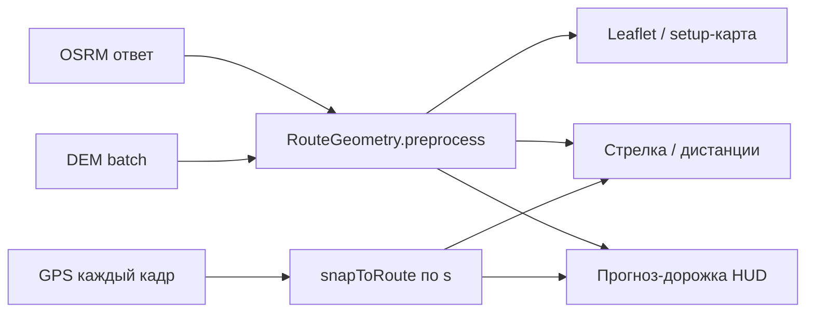

# ROADPATH-PLAN — прогноз-дорожка и связь с картой

> План переработки псевдо-3D-ленты маршрута в HUD «Мото-ИЛС».  
> Контекст: `index.html` + `js/render.js` (SVG + rAF), маршрут OSRM, эмулятор `sim.html`.  
> Связь с продуктом: [`MASTERPLAN.md`](../MASTERPLAN.md) (Фаза 0, сквозной трек ROADPATH).  
> Детали реализации RouteGeometry: `docs/route-geometry.md`. Спайк роутеров: `docs/router-spike.md`.

---

## Почему ломается сейчас

Исторически три независимых «мира»:

| Слой | Что использует |
|------|----------------|
| Карта (setup) | сырой polyline OSRM в Leaflet |
| Навигация (стрелка, дистанции) | `steps` + ближайшая точка по индексу |
| Прогноз-дорожка | те же `coords`, но `localCtx()` + `projectGround()` по **GPS-курсу** |

**Корневые проблемы:**

1. **Ось «вперёд» — GPS-курс, а не маршрут.** На повороте GPS отстаёт/обгоняет касательную → полилиния «уезжает» вбок, изломы на экране.

2. **Срез маршрута не от текущей позиции на polyline.** Берётся GPS как `{x:0, z:0}`, точки — «следующая вершина после idx», без проекции на сегмент → разрыв в начале ленты.

3. **OSRM даёт редкую геометрию.** На острых поворотах длинные прямые между вершинами → при досэмплинге углы, а не дуга; перпендикуляры к углам → самопересечение ленты.

4. **Naive snap на серпантинах.** На шпильке встречные ноги в 10–30 м; «ближайший сегмент» перескакивает на другую ногу → дорожка на кадр разворачивается на 180°.

5. **Камера и viewBox пляшут.** Подгонка bbox каждый кадр + резкий поворот касательной на выходе из шпильки → «мотает» весь экран.

6. **Нет общей подготовленной геометрии.** Карта, HUD и snap пересчитывают разное каждый кадр.

---

## Целевая модель: один маршрут — одна геометрия

При построении маршрута (тот же момент, что карта) один раз собрать **`RouteGeometry`** и хранить в `S.route`:

| Поле | Тип | Описание |
|------|-----|----------|
| `lat`, `lon` | `Float64Array` | Уплотнённая polyline (~2–5 м). На 300 км ≈ 100k точек — **не** массив объектов `{lat,lon}` |
| `s` | `Float64Array` | Длина дуги от старта, м (рядом с `lat`/`lon`) |
| `elev` | `Float64Array` | Высота DEM в точках dense (этап 2.5) |
| `grade` | `Float64Array` | Уклон Δelev/Δs (этап 2.5) |
| `curvature` | `Float64Array` | Кривизна / радиус R в точках (этап 3) |
| `safeSpeed` | `Float64Array` | Безопасная скорость входа, м/с (этап 3) |
| `maneuvers` | `Array` | `{ s, lat, lon, angle, step }` из OSRM steps |
| `n` | `number` | Число точек |

Карта, оставшееся расстояние, камеры, АЗС и дорожка читают **один и тот же `dense` + `s`**.  
Snap, дистанции и HUD работают по **длине дуги `s`**, не по индексу вершины.

### Как строить дорожку (ключевое)

**Snap по длине дуги.** Каждый кадр: GPS → `(s₀, lateral)`; срез **`[s₀ … s₀ + maxDist]`** вдоль dense.

**Локальная система Frenet.** Вперёд = касательная polyline; вбок = нормаль. Камера смотрит вдоль **сглаженной касательной маршрута**, не GPS-курса (GPS — компас, камеры «в спину»).

**Per-point Frenet + triangle strip.** Поперечные сечения ленты в каждой точке `s` → проекция → отрисовка strip mesh; painter's order от дальних `s` к ближним.

**Стабильная камера.** Фиксированный viewBox; «мотоцикл» внизу по центру; двигается только геометрия впереди.

---

## Связь с картой

Не тащить Leaflet в HUD — **синхронизировать данные**:

| На setup-карте | На HUD |
|----------------|--------|
| polyline = та же геометрия маршрута (dense или coords до полной унификации) | тот же источник, другой рендер |
| выбранный вариант → пересборка `RouteGeometry` | автоматически та же геометрия |
| подсветка «окна HUD» (2–5 км вперёд) | ровно этот отрезок на дорожке |

Смена альтернативы → один `preprocess()` → карта + HUD из одного источника.

---

## Этапы внедрения

### Этап 1 — точность (мало риска, большой эффект)

**Цель:** дорожка не отрывается от маршрута; стабильность на прямых и первый проход серпантинов.

- [x] `buildRouteGeometry()` при построении / смене альтернативы (асинхронно, не блокирует «ПОЕХАЛИ»).
- [x] **`lat[]`, `lon[]`, `s[]` в `Float64Array`** — на 300 км ~100k точек; быстрый срез на кадр, меньше памяти, чем `{lat,lon}[]`.
- [x] **Snap по `s`**, не по индексу; срез `[s₀ … s₀ + maxDist]`.
- [x] **`snapToRoute()` с ограничениями для серпантинов:**
  - поиск **только в окне `s` вокруг последнего известного `s₀`** (целевое: ±150 м; текущая реализация: `[s₀ − 30 м, s₀ + 150 м]` + монотонное продвижение вперёд, `s ≥ s₀ − 5 м` кроме явного офф-роута);
  - при неоднозначности — **сверка касательной кандидата с GPS-курсом** (согласие направлений `dot >` порога, сейчас ~0.3);
  - скоринг: `lateral + λ·(1 − dot)` — выбор «правильной» ноги шпильки.
- [x] Курс дорожки = **касательная маршрута**, не GPS.

**Готово, когда:** на прямых лента совпадает с маршрутом; на серпантине snap не перескакивает на встречную ногу в типичном сценарии.

---

### Этап 2 — повороты

**Цель:** плавные шпильки без «бабочек» и дёрганья камеры.

- [x] **Сглаживание углов OSRM:** основной метод — **вставка дуги с явным радиусом** (угол из `steps` + минимальный радиус шпильки **10–15 м**, сейчас R_min ≈ 12 м). Угол `< 15°` — линейная интерполяция.
  - **Catmull-Rom** — только fallback, если дуга не применима.
  - **Chaikin — не использовать** (срезает вершину шпильки, геометрия уезжает с реальной дороги). Явный радиус дуги нужен также этапу 3 (безопасная скорость).
- [x] **Per-point Frenet** + **triangle strip mesh** (вместо quad-сегментов по экранным offset).
- [x] **Clamp внутренней кромки ленты:** когда полуширина ленты > радиуса поворота, offset-точки внутренней стороны ограничиваются (`offset ≤ R − ε`, в метрах east/north, не в экране). Одним сглаживанием не лечится.
- [x] **Сглаживание касательной камеры:**
  - пространственно: усреднение по окну **`[s₀, s₀ + 25 м]`**;
  - временно: экспоненциальное сглаживание (~`α ≈ 0.12`/кадр).
- [x] **Инвариант рендера:** рисовать **от дальних `s` к ближним** (painter's algorithm) — перекрытие ног серпантина на разной высоте (важно для этапа 2.5).
- [x] Фиксированный viewBox (`0 0 L.W L.H`), без подгонки bbox каждый кадр.

**Готово, когда:** острые шпильки без разрывов ленты; камера не «моет» экран на выходе из поворота.

---

### Этап 2.5 — «Рельеф»

**Цель:** читаемый профиль серпантина; 3D-наклон без смешения с багами Frenet.

**Данные (расширение RouteGeometry):**

- [x] `elev[]` в точках dense — batch-запрос при построении маршрута.
- [x] `grade[] = Δelev/Δs` после **сглаживания сырого DEM окном 50–100 м** (сейчас ~75 м).
- **Источники высот** (OSRM высот **не отдаёт**):

  | Фаза | Источник |
  |------|----------|
  | Онлайн | AWS Terrain Tiles (Terrarium, без ключа) или OpenTopoData batch |
  | Офлайн (задел Фазы 4 MASTERPLAN) | SRTM / Copernicus GLO-30 HGT, с регионом |
  | Спайк роутеров | GraphHopper `elevation=true`, BRouter — **да**; критерий «высоты из коробки» зафиксирован в `docs/router-spike.md` |

**Рендер рельефа (порядок приоритета):**

1. [x] **Полоска-профиль высоты** на ближайшие **2–5 км** (сейчас 3 км) с отметками манёвров — **делать первой**, дешево и читаемо на ходу. Линия сегментами по `grade`; **числовые метки** «+8%» / «−6%» на профиле (локальные пики) и на осевой ленты.
2. [x] **Наклон псевдо-3D-ленты:** высота относительно текущей позиции → вертикаль в `projectGround()`; камера наклоняется по текущему уклону; вертикальное преувеличение **×1.5–2** (настройка `elevExag`, по умолчанию 1.8).  
   *Только после стабилизации Frenet этапа 2 — иначе два источника дёрганья.*
3. [ ] **Окраска ленты по крутизне уклона** — **опционально, отложено.** Лента сейчас **нейтральная** (зарезервирована под этап 3 — предупреждение скорости). Уклон показывается профилем и маркерами на оси.

На setup-карте: подсветка первых **3 км** («окно HUD»).

**Готово, когда:** «впереди 300 м вверх, потом шпилька и спуск» читается без карты; 3D-наклон не ломает Frenet.

---

### Этап 3 — «Ассистент поворотов (curve speed warning)»

**Цель:** предупреждение о **скорости входа в поворот** — аналог curve speed warning (Garmin Zumo / ADAS).  
**Не** подсказка траектории: racing line отброшен (встречная полоса, нет ширины полотна, юридический риск).

**Данные (preprocess, один раз):**

- [ ] `curvature[]` и `safeSpeed[]` в RouteGeometry.
- [ ] Физика: `v = sqrt(a_lat · R)`; консервативно **`a_lat = 0.3–0.35 g`**; уклон вниз из `grade[]` **ужесточает** оценку.

**Индикация:**

- [ ] **Окраска сегментов ленты** по отношению `v_current / v_safe(s)` с **гистерезисом** (асимметричная семантика: красный/жёлтый = «внимание»; **зелёный как сигнал отсутствует** — нейтральный цвет ленты = «нет предупреждения»).
- [ ] **Тон / голос** за **N секунд хода** до поворота — через существующую приоритезацию подсказок (не по фиксированным метрам).
- [ ] **В самом повороте новой индикации не добавлять** — всё предупреждение **до входа**; взгляд на экран в наклоне опасен.

**Защита от ложных срабатываний:**

- [ ] Минимальная длина дуги; срабатывание только при **`R < ~100 м`**.
- [ ] Гистерезис порогов; настройка «строже / мягче»; возможность **полностью выключить**.

**Бэклог этапа:** калибровка личного `a_lat` по записанным GPX-трекам пользователя.

**Готово, когда:** на шпильке с завышенной скоростью — жёлтый/красный сегмент и голос **до** поворота; на прямой и мягких дугах — тишина и нейтральная лента.

---

### Этап 4 — связка с картой

*(бывший «Этап 3»)*

**Цель:** «построил на карте = едешь по тому же».

- [x] Карта рисует маршрут из того же `S.route` (сейчас `coords`; dense — по мере оптимизации Leaflet).
- [x] Маркеры поворотов и дистанции привязаны к `s` / geometry snap.
- [x] Превью «окна HUD» на setup (подсветка 3 км).
- [ ] Полная унификация: polyline карты = `dense` без дублирования OSRM-вершин.
- [ ] АЗС и POI на карте и дорожке из одного `s`-пространства.

**Готово, когда:** визуально карта и HUD показывают одну трассу; смена альтернативы обновляет оба без рассинхрона.

---

## Что сознательно не делать

- Не строить дорожку заново из `steps` без polyline — нужна непрерывная линия.
- Не привязывать **форму** дороги к GPS-heading — только к геометрии маршрута.
- Не менять viewBox каждый кадр по bbox — главный источник дёрганья.
- Не дублировать логику «ближайшая точка» в render и route — один `snapToRoute()`.
- Не использовать **Chaikin** на шпильках — срезает вершину с реальной дороги.
- **Не рисовать идеальную траекторию / racing line** — нет данных о полосе и покрытии, юридический риск.
- **Не показывать «зелёный = можно быстрее»** — навигатор не сертифицирует безопасность и не знает погоду/покрытие.

---

## Ожидаемый результат

| Этап | Результат |
|------|-----------|
| **1** | Дорожка не отрывается от маршрута; snap не прыгает между ногами серпантина. |
| **2** | Плавные повороты без самопересечений ленты; стабильная камера. |
| **2.5** | Читаемый рельеф впереди: профиль + 3D-наклон; лента нейтральная. |
| **3** | Предупреждение скорости **до** крутого поворота; лента = индикатор `v / v_safe`. |
| **4** | Карта и HUD — одна трасса; окно setup = окно дорожки. |

После этапов 1–2.5 прототип пригоден для полевых тестов на серпантинах. Этап 3 — дифференциатор «мото-ИЛС» vs обычный навигатор. Этап 4 закрывает доверие пользователя к построенному маршруту.

---

## Changelog ревизии

- **Этап 1:** ужесточён `snapToRoute()` — окно по `s` вокруг `s₀`, монотонность вперёд, сверка касательной с GPS-курсом при неоднозначности (серпантины).
- **Этап 1:** добавлено требование `Float64Array` для `dense[]` и `s[]` (~100k точек на 300 км).
- **Этап 2:** сглаживание углов — дуга с явным радиусом (10–15 м); Catmull-Rom только fallback; Chaikin помечен как нежелательный.
- **Этап 2:** добавлен clamp внутренней кромки ленты при `halfW > R`.
- **Этап 2:** уточнено сглаживание камеры — окно `[s₀, s₀+25 м]` + экспоненциальное сглаживание во времени.
- **Этап 2:** зафиксирован инвариант painter's algorithm (дальние `s` → ближние).
- **Новый этап 2.5 «Рельеф»:** `elev[]`/`grade[]`, DEM batch, сглаживание 50–100 м, источники Terrarium/OpenTopo/HGT, критерий высот в спайке роутеров.
- **Этап 2.5:** приоритет рендера — (a) профиль, (b) 3D-наклон после Frenet, (c) окраска ленты по grade опционально.
- **Новый этап 3 «Ассистент поворотов»:** curve speed warning, `curvature[]`/`safeSpeed[]`, окраска ленты по `v/v_safe`, голос до входа, без racing line.
- **Этап 3 (бывший):** перенумерован в **этап 4** «Связка с картой»; обновлены перекрёстные ссылки и «Ожидаемый результат».
- **«Что не делать»:** добавлены запрет racing line и «зелёный = можно быстрее».
- **Mermaid:** Prep получает вход DEM; выходы включают `elev`/`grade`/`safeSpeed`.
- **Сверка с кодом (2026-07-04):** этапы 1, 2, 2.5 в основном реализованы; уклон — **числовые метки «±N%»** на осевой и профиле; лента нейтральна под этап 3; асимметричное окно snap `[−30, +150]` м — уточнить до ±150 м при следующей итерации snap.
- **2026-07-04:** уклон — числовые метки «±N%» вместо ▲/▼; связь с `MASTERPLAN.md` (таблица этапов ROADPATH в Фазе 0).
