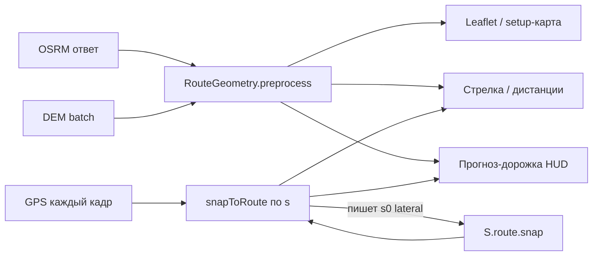

# ROADPATH-PLAN — прогноз-дорожка и связь с картой

> План переработки псевдо-3D-ленты маршрута в HUD «Мото-ИЛС».  
> Контекст: `index.html` + `js/render.js` (SVG + rAF), маршрут OSRM, эмулятор `sim.html`.  
> Связь с продуктом: [`MASTERPLAN.md`](../MASTERPLAN.md) (Фаза 0, сквозной трек ROADPATH).  
> Детали реализации RouteGeometry: `docs/route-geometry.md`. Спайк роутеров: `docs/router-spike.md`.  
> Регрессия: [`regression/`](../regression/) · полевые треки / golden — по мере появления fixture.

---

## Почему ломается сейчас

Исторически три независимых «мира»:

| Слой | Что использует |
|------|----------------|
| Карта (setup) | сырой polyline OSRM в Leaflet |
| Навигация (стрелка, дистанции) | `steps` + ближайшая точка по индексу |
| Прогноз-дорожка | те же `coords`, но `localCtx()` + `projectGround()` по **GPS-курсу** |

**Корневые проблемы:**

1. **Ось «вперёд» — GPS-курс, а не маршрут.** На повороте GPS heading отстаёт от касательной polyline: ориентир **~15–25° при ~60 км/ч** в фазе входа/дуги, стабилизация **~2–3 с** после выхода (полевые оценки; уточнять на reference-треках). Пока ось = GPS, лента «уезжает» вбок.

2. **Срез маршрута не от текущей позиции на polyline.** Берётся GPS как `{x:0, z:0}`, точки — «следующая вершина после idx», без проекции на сегмент → разрыв в начале ленты.

3. **OSRM даёт редкую геометрию.** На острых поворотах длинные прямые между вершинами → при досэмплинге углы, а не дуга; перпендикуляры к углам → самопересечение ленты.

4. **Naive snap на серпантинах.** На шпильке встречные ноги в 10–30 м; «ближайший сегмент» перескакивает на другую ногу → дорожка на кадр разворачивается на 180°.

5. **Камера и viewBox пляшут.** Подгонка bbox каждый кадр + резкий поворот касательной на выходе из шпильки → «мотает» весь экран.

6. **Нет общей подготовленной геометрии.** Карта, HUD и snap пересчитывают разное каждый кадр.

**Ограничение данных (не лечится только densify):** RouteGeometry исправляет **дискретизацию** ответа роутера. Она **не заменяет** отсутствующие или кривые OSM-данные (дыры в сети, разный качество регионов, «ломаный» граф на местной дороге vs магистраль). Плохой OSM → плохой маршрут и лента; densify не создаёт съезды и полосы, которых нет в данных.

---

## Целевая модель: один маршрут — одна геометрия

При построении маршрута (тот же момент, что карта) один раз собрать **`RouteGeometry`** и хранить в `S.route`:

| Поле | Тип | Описание |
|------|-----|----------|
| `lat`, `lon` | `Float64Array` | Уплотнённая polyline (~2–5 м на ближних участках; см. лимиты длины) |
| `s` | `Float64Array` | Длина дуги от старта, м |
| `heading` | `Float64Array` | Предвычисленная касательная (рад или °) в каждой точке — **не** считать из соседей каждый кадр на срезе |
| `elev` | `Float64Array` | Высота DEM (этап 2.5), **без** visual exagger |
| `grade` | `Float64Array` | Уклон Δelev/Δs для **физики** и меток (этап 2.5 / 3), без `elevExag` |
| `curvature` / `radius` | `Float64Array` | Кривизна / R (этап 3) |
| `safeSpeed` | `Float64Array` | Безопасная скорость входа, м/с (этап 3) |
| `maneuvers` | `Array` | `{ s, lat, lon, angle, step }` из OSRM steps |
| `n` | `number` | Число точек |

**Состояние snap между кадрами** (не часть dense, но контракт):

| Поле | Где | Описание |
|------|-----|----------|
| `s0`, `lateral`, качество | `S.route.snap` / аналог (`getNavSnap`) | Последний успешный snap; окно поиска следующего кадра якорится на `s0` |

Карта, оставшееся расстояние, камеры, АЗС и дорожка читают **один и тот же `dense` + `s`**.  
Snap, дистанции и HUD работают по **длине дуги `s`**, не по индексу вершины.

### Лимиты длины и плотность

- **Полный preprocess** (шаг 2–5 м + DEM + curve): до **500 км**.
- Свыше 500 км — **lazy**: подробно ближайшие **~200 км**, дальние с шагом **~10 м**; при приближении к «хвосту» — достройка окна.
- Оценка RAM (ориентир): 300 км ≈ 100k точек; 1000 км при полной плотности ~350k × несколько `Float64Array` → десятки МБ; альтернативы маршрута не держать все dense одновременно без нужды (одна активная + invalidate).

```mermaid
flowchart LR
  OSRM[OSRM ответ] --> Prep[RouteGeometry.preprocess]
  DEM[DEM batch] --> Prep
  Prep --> Map[Leaflet / setup-карта]
  Prep --> Nav[Стрелка / дистанции]
  Prep --> Path[Прогноз-дорожка HUD]
  GPS[GPS каждый кадр] --> Snap[snapToRoute по s]
  Snap -->|пишет s0 lateral| SnapState[S.route.snap]
  SnapState --> Snap
  Snap --> Path
  Snap --> Nav
```

### Как строить дорожку (ключевое)

**Snap по длине дуги.** Каждый кадр: GPS → `(s₀, lateral)`; срез **`[s₀ … s₀ + maxDist]`** вдоль dense.

**Локальная система Frenet.** Вперёд = касательная polyline (`heading[]`); вбок = нормаль. Камера смотрит вдоль **сглаженной касательной маршрута**, не GPS-курса (GPS — компас, камеры «в спину»).

**Per-point Frenet + triangle strip.** Поперечные сечения ленты в каждой точке `s` → проекция → отрисовка strip mesh; painter's order от дальних `s` к ближним.

**Стабильная камера.** Фиксированный viewBox; «мотоцикл» внизу по центру; двигается только геометрия впереди.

---

## Сквозные контракты (перед реализацией / доработкой)

### 1. Количественные критерии готовности

Качественное «готово, когда…» дополняется метрикой на reference-треках. Без числа регрессию не поймать.

| Этап | Метрика (минимум) |
|------|-------------------|
| **1** | На треке-серпантине (цель: `20-serpentine-500` / аналог в `regression`/`fixtures`): доля кадров с **snap-jump > 30 м** **< 1%**. Lateral p95 на прямых — в допуске fixture. |
| **2** | **Camera-heading jitter:** дисперсия сглаженного курса за 1 с ниже порога fixture; визуально нет «бабочек» на reference-шпильках. |
| **2.5** | DEM prefetch укладывается в бюджет; при отсутствии DEM — явная деградация (плоская лента), без NaN в render. |
| **3** | На шпильке с завышенной скоростью — предупреждение **до** входа; на прямой false-positive ниже порога fixture; гистерезис без мерцания на границе. |
| **4** | После preprocess карта и HUD — одна dense-трасса; смена альтернативы без рассинхрона (автопроверка id геометрии / hash). |
| **5** | На reference-развязке ghost появляются до манёвра; primary однозначно читается; при отсутствии Overpass — тихий fallback без падения FPS. |

**Гейт между этапами:** перед стартом следующего — прогон регрессии предыдущих на reference-треках, запись метрик до/после. При регрессии предыдущего — **не** начинать следующий, чинить.

Порядок: **1 → 2 → 2.5 → 3 → 4 → 5** (нумерация с «2.5» сохранена исторически; по смыслу шесть фаз).

### 2. Performance budgets (baseline: mid Android, напр. Samsung A50)

| Операция | Бюджет | При превышении |
|----------|--------|----------------|
| Preprocess полного RouteGeometry на **300 км** | **≤ 5 с** | Web Worker и/или progressive / lazy densify; не блокировать HUD tick |
| Snap на кадр | **≤ 5 мс** | сузить окно, индекс по `s`, профилировать |
| DEM prefetch (маршрут 300 км, 4G) | **≤ 30 с** | реже якоря, кэш tiles, не блокировать старт |
| Overpass corridor (этап 5) | ответ желательно **≤ 8 с**; старт запроса заранее | опоздал после манёвра → discard |

Замеры — на реальных телефонах; цифры в плане обновлять по факту.

### 3. Фолбэки внешних зависимостей

| Условие | Поведение |
|---------|-----------|
| Нет DEM / нет сети при build | Плоская лента, профиль скрыт; `elevReady=false`; физика curve-speed без ужесточения по grade |
| Нет Overpass / таймаут | Этап 5: без ghost; primary как сейчас |
| Офлайн после кэша | Работа на закэшированной geometry (+ tiles DEM если были) |
| NaN / битая curvature | Этап 3 выключен для этой geometry; лента нейтральна |
| Preprocess > 5 с | Worker / progressive; карта на сырой OSRM до готовности dense |

### 4. Reroute

- При смене маршрута: старая дорожка **fade ~500 мс**, новая — после preprocess.
- Preprocess стартует **сразу**, не ждёт конца fade.
- Debounce preprocess при частых reroute: **не чаще 1 раза / 3 с** (городской junk GPS).

### 5. Режимы HUD / карта / bearing

| Режим | Preprocess |
|-------|------------|
| **HUD** (дорожка видна) | Полный / продолжается |
| **Карта** | Продолжается (карта потребитель dense) |
| **Bearing** | **Пауза** preprocess/тяжёлых DEM-хвостов для батареи; возобновление при возврате в HUD |

### 6. Пользовательские настройки («Экран в пути»)

| Фича | Настройки |
|------|-----------|
| Этап 2.5 | Профиль высот вкл/выкл; `elevExag`: плоско **1.0** / норма **1.8** / выразительно **2.5** |
| Этап 3 | Curve speed вкл/выкл; пресет мягче / норма / строже; disclaimer UI: пресеты для **сухого асфальта**, в дождь — снижать |
| Этап 5 | Ghost ribbons вкл/выкл |

`elevExag` — **только рендер**. `grade[]` / физика этапа 3 — **без** преувеличения.

### 7. Регрессия

- Reference-треки / fixture в `regression/` или `fixtures/` на серпантин, рельеф, развязку.
- При изменениях `route-geometry.js` / `render.js` / `elevation.js` / `curve-speed.js` / interchange-corridor — sim-прогон + метрики: snap-jump ratio, camera-heading jitter, lateral p95, DEM/Overpass timing где применимо.
- Этап 5: mock Overpass JSON для известных развязок (не бить публичный Overpass в CI).

### 8–10. См. этапы 1 и 5

Edge cases snap → этап 1. Structural Z и лимиты ghost → этап 5. Разделение elevExag / grade → этапы 2.5 и 3.

---

## Связь с картой

Не тащить Leaflet в HUD — **синхронизировать данные**:

| На setup-карте | На HUD |
|----------------|--------|
| polyline = та же геометрия маршрута (dense или coords до полной унификации) | тот же источник, другой рендер |
| выбранный вариант → пересборка `RouteGeometry` | автоматически та же геометрия |
| подсветка «окна HUD» (2–5 км вперёд) | ровно этот отрезок на дорожке |

Смена альтернативы → один `preprocess()` → карта + HUD из одного источника.

**UX ожидания preprocess:** карта сразу рисует **сырую OSRM polyline**; по готовности dense — обновление без визуального скачка (те же коридоры, плотнее). HUD до готовности — сырая/упрощённая лента или ожидание без ложного «отрыва».

---

## Этапы внедрения

### Этап 1 — точность (мало риска, большой эффект)

**Цель:** дорожка не отрывается от маршрута; стабильность на прямых и первый проход серпантинов.

- [x] `buildRouteGeometry()` при построении / смене альтернативы (асинхронно, не блокирует «ПОЕХАЛИ»).
- [x] **`lat[]`, `lon[]`, `s[]` в `Float64Array`**.
- [x] **`heading[]`** предвычисленный (рад) в `buildRouteGeometry`.
- [x] **Snap по `s`**, не по индексу; срез `[s₀ … s₀ + maxDist]`.
- [x] **`snapToRoute()` с ограничениями для серпантинов:**
  - поиск в окне вокруг последнего `s₀` (адаптивное `{back,fwd}` + монотонность вперёд);
  - **bootstrap:** первый snap — **полный** поиск по маршруту, затем оконный режим;
  - **адаптивное окно по скорости:** `spd < 5 км/ч` → **±100 м**; `spd > 50 км/ч` → `[-15, +200] м`;
  - сверка касательной с GPS-курсом: `SNAP_MIN_DOT` ≈ 0.71;
  - при **GPS accuracy > 30 м**: снижен вес `dot`, жёсткий heading-gate ослаблен;
  - скоринг: `lateral + λ·(1 − dot)`.
- [x] Курс дорожки = **касательная маршрута**, не GPS.
- [x] Индикатор качества snap / junk GPS — связан с offroute (не ломать при доработке окна).

**Метрика готовности:** snap-jump > 30 м реже **1%** кадров на reference-серпантине; snap ≤ 5 мс/кадр.

**Готово, когда:** метрика зелёная; на прямых лента совпадает с маршрутом; bootstrap и slow-speed окна не дают ложный LOST при остановке.

---

### Этап 2 — повороты

**Цель:** плавные шпильки без «бабочек» и дёрганья камеры.

- [x] **Сглаживание углов OSRM:** дуга с явным радиусом (R_min ≈ **12 м**). Угол `< 15°` — линейная интерполяция.
  - **Catmull-Rom** — только fallback.
  - **Chaikin — не использовать:** срезает вершину **и** не даёт контролируемого R для этапа 3 (curve speed).
  - **Близкие манёвры:** если расстояние между манёврами **< 2×R_min** — общая составная дуга или пометка «не сглаживать» (угловая геометрия), без наложений двух дуг R=12.
- [x] **Per-point Frenet** + **triangle strip mesh**.
- [x] **Clamp только внутренней кромки** ленты (`offset ≤ R − ε` в метрах EN); наружную не сжимать симметрично (иначе лента «худеет» на повороте).
- [x] **Сглаживание касательной камеры:**
  - пространственно: окно **`[s₀, s₀ + 25 м]`**;
  - временно: α ≈ 0.12/кадр → порядок **~250–400 мс** отклика при 30 FPS; целевой компромисс **~300–500 мс** — калибровать на треках (слишком быстро = дёрганье, слишком медленно = лаг на выходе из шпильки).
- [x] Painter's order дальние → ближние; фиксированный viewBox.

**Метрика готовности:** camera-heading jitter ниже порога fixture; нет bow-tie на reference-шпильках.

**Готово, когда:** метрика зелёная; острые шпильки без разрывов ленты.

---

### Этап 2.5 — «Рельеф»

**Цель:** читаемый профиль серпантина; 3D-наклон без смешения с багами Frenet.

**Данные:**

- [x] `elev[]` / `grade[]` после сглаживания сырого DEM окном **~75 м** (диапазон 50–100 м).
- Алгоритм сглаживания: зафиксировать в коде/доке (**предпочтительно** гауссово окно или Savitzky–Golay для чистой производной grade; не оставлять «просто среднее» без явного выбора).
- Источники: Terrarium / OpenTopo; офлайн HGT — задел Фазы 4.

**DEM / сеть:**

- Prefetch при построении маршрута (желательно Wi‑Fi / до выезда); в поездке — кэш tiles.
- Объём ориентир: десятки tiles на 300 км, единицы МБ — терпимо; не качать зря в фоне на слабом 4G без нужды.
- **Zoom:** для профиля на ближайшие **2–5 км** — более детальный уровень (ориентир z14–15), для дальнего хвоста достаточно z12 (~30 м) — иначе grade «+8%» на 300 м шумный.
- OpenTopo публичный: rate limit / batch size — якоря **разреженно** (50–200 м) + интерполяция на dense; либо свой прокси. Не планировать 100k отдельных HTTP на точку.

**Рендер:**

1. [x] Полоска-профиль 2–5 км (сейчас 3 км).
2. [x] Наклон ленты через `projectGround`; **`elevExag` только visual** (1.0 / 1.8 / 2.5 в настройках).
3. [ ] Окраска ленты по grade — отложено (лента под этап 3).

**Метки уклона «+8%» / «−6%»:** не чаще чем нужно для чтения — правило: при **|grade| ≥ 3%** на локальных пиках / не чаще чем раз в **~400–600 м** вдоль профиля (уточнить на sim), без стены цифр в городе.

**Метрика готовности:** бюджет DEM; деградация без DEM без краша; visual elevExag не влияет на `grade[]` для физики.

**Готово, когда:** рельеф читается; Frenet не ломается; настройки профиля / exagger работают.

---

### Этап 3 — «Ассистент поворотов (curve speed warning)»

**Цель:** предупреждение о **скорости входа в поворот**. Racing line запрещён.

**Данные:**

- [x] `radius[]` / `safeSpeed[]` (`js/curve-speed.js`).
- R — **сглаженный** по окну **~30–50 м**, не сырой мгновенный на дискретизации.
- `v = sqrt(a_lat · R)`; пресеты 0.28–0.35 g (**сухой асфальт** — disclaimer в UI).
- Уклон вниз ужесточает: явная формула в коде/доке, ориентир  
  `a_eff ≈ a_lat − g·sin(θ)` на спуске (для |grade|~8% это порядка **0.08 g**); использовать **raw grade**, не visual.
- [x] Окраска ленты / голос за ~3–7 с до входа; внутри поворота — выкл.
- [x] **Гистерезис MVP:** on ≈ **0.95×** порога предупреждения, off ≈ **0.90×** (антимерцание); полный настраиваемый — v1.1.
- **Приоритет голоса:** curve-speed warning **выше** обычного манёвра OSRM, если оба в одном временном окне.

**Метрика готовности:** true positive до шпильки на fixture; false positive на прямой ниже порога; нет мерцания на границе v/v_safe.

**Готово, когда:** метрика зелёная; чекбокс выключения и пресеты на месте.

---

### Этап 4 — связка с картой

**Цель:** «построил на карте = едешь по тому же».

- [x] Карта из dense (fallback — сырая OSRM до preprocess).
- [x] Маркеры / дистанции / окно HUD / АЗС по `s`.
- **АЗС:** показывать при **lateral к маршруту < 100–200 м** (snap на dense), не только «радиус от случайной точки»; привычный радиус — вторичный fallback.
- UX preprocess — см. «Связь с картой» выше.

**Метрика готовности:** одна geometry id у карты и HUD после preprocess; смена альтернативы синхронна.

**Готово, когда:** метрика зелёная; нет рассинхрона при переключении вариантов.

---

### Этап 5 — POV-развязка (ghost ribbons)

**Цель:** перед съездом / развилкой показать **локальную развязку от первого лица** — тот же ракурс, что у прогноза-дорожки. Primary яркий; соседние ветки — ghost.

**Не цель:** схема сверху, city-GLB / Three.js-город.

#### Камера и склейка (инвариант)

`snap (s₀) → Frenet / cam heading → worldToCamXZ → projectGround(demElev [+ layerOffset для ghost])`

- Общие: `s₀`, касательная, pitch, viewBox, painter's order.
- Fade слоя ghost без смены проекции.

#### Когда включать

- Впереди `off ramp` | `on ramp` | `fork` или `path_diverge`.
- **Старт Overpass:** за **~1500–2000 м** до манёвра (при 90 км/ч запас на 2–8+ с ответа); debounce; опоздал после проезда → **игнорировать**.
- Показ ghost — как только данные готовы и манёвр ещё впереди.
- Bbox: простой off-ramp **~400 м**; крупная развязка **~800–1200 м** (по типу step / эвристике размера).

#### Данные и structural Z

| Слой | Источник | Роль |
|------|----------|------|
| Primary | `RouteGeometry` | Ваш путь |
| Corridor | Overpass `highway=*` | Соседние ветки |
| DEM | этап 2.5 | Общий уклон местности |
| Уровни | `bridge` / `tunnel` / `layer` | Визуальное разведение ярусов |

- DEM = рельеф; **не** высота палубы эстакады.
- При наличии `layer`: **`layerOffset = layer × 5 м`** — **визуальное** разделение, не обмер сооружения.
- При **отсутствии** layer/bridge: все ветки на одном ярусе; различие **opacity / ширина** primary vs ghost.
- В UI (кратко): эстакады **условны**, приоритет — знаки и разметка.
- Прореживание 5–10 м **с сохранением junction nodes** (не наивный decimation, ломающий топологию).
- Лимиты кадра: **≤ 8** ghost ways, **≤ 500** сегментов ghost; иначе primary + **1–2** ближайших съезда.
- Sim/CI: **mock** Overpass JSON для известных развязок.

#### Рендер / UX

- [x] Спайк: `js/interchange-corridor.js` + рендер в `render.js` (та же камера).
- [x] Primary matching по близости к dense.
- [x] Настройка вкл/выкл (`opt-ghost-ribbons`); не перебивать primary на трассе.
- [x] Mock Overpass JSON: `fixtures/ghost-corridor-mock.json` + `__motoHUD.injectMockCorridor`.
- [ ] Reference-развязка + метрики FPS/snap на полевом кейсе (Varshavka).

**Метрика готовности:** на reference-развязке ghost до манёвра; без Overpass — тихий fallback; FPS/snap бюджеты не нарушены.

**Готово, когда:** метрика зелёная; склейка с дорожкой без скачка камеры.

---

## Что сознательно не делать

- Не строить дорожку заново из `steps` без polyline — нужна непрерывная линия.
- Не привязывать **форму** дороги к GPS-heading — только к геометрии маршрута.
- Не менять viewBox каждый кадр по bbox — главный источник дёрганья.
- Не дублировать логику «ближайшая точка» в render и route — один `snapToRoute()`.
- Не использовать **Chaikin** на шпильках — срезает вершину и ломает контроль R.
- **Не рисовать racing line** / «зелёный = можно быстрее».
- **Не подменять POV схемой развязки сверху.**
- **Не считать DEM достаточным для эстакад.**
- **Не тащить city-GLB / Three.js-город в HUD.**
- **Не начинать следующий этап при красной регрессии предыдущего.**

---

## Ожидаемый результат

| Этап | Результат |
|------|-----------|
| **1** | Snap стабилен; метрика jump < 1%; bootstrap и slow-speed ок. |
| **2** | Шпильки без бабочек; камера с калиброванным лагом. |
| **2.5** | Рельеф читается; elevExag ≠ physics grade. |
| **3** | Curve-speed до входа; гистерезис; приоритет голоса. |
| **4** | Карта = HUD dense; АЗС по lateral к маршруту. |
| **5** | Ghost-ветки в том же POV; structural Z условен. |

---

## Changelog ревизии

- **Этап 1:** ужесточён `snapToRoute()` — окно по `s` вокруг `s₀`, монотонность вперёд, сверка касательной с GPS-курсом при неоднозначности (серпантины).
- **Этап 1:** добавлено требование `Float64Array` для `dense[]` и `s[]` (~100k точек на 300 км).
- **Этап 2:** сглаживание углов — дуга с явным радиусом (10–15 м); Catmull-Rom только fallback; Chaikin помечен как нежелательный.
- **Этап 2:** добавлен clamp внутренней кромки ленты при `halfW > R`.
- **Этап 2:** уточнено сглаживание камеры — окно `[s₀, s₀+25 м]` + экспоненциальное сглаживание во времени.
- **Этап 2:** зафиксирован инвариант painter's algorithm (дальние `s` → ближние).
- **Новый этап 2.5 «Рельеф»:** `elev[]`/`grade[]`, DEM batch, сглаживание 50–100 м, источники Terrarium/OpenTopo/HGT, критерий высот в спайке роутеров.
- **Этап 2.5:** приоритет рендера — (a) профиль, (b) 3D-наклон после Frenet, (c) окраска ленты по grade опционально.
- **Новый этап 3 «Ассистент поворотов»:** curve speed warning, `curvature[]`/`safeSpeed[]`, окраска ленты по `v/v_safe`, голос до входа, без racing line.
- **Этап 3 (бывший):** перенумерован в **этап 4** «Связка с картой»; обновлены перекрёстные ссылки и «Ожидаемый результат».
- **«Что не делать»:** добавлены запрет racing line и «зелёный = можно быстрее».
- **Mermaid:** Prep получает вход DEM; выходы включают `elev`/`grade`/`safeSpeed`.
- **Сверка с кодом (2026-07-04):** этапы 1, 2, 2.5 в основном реализованы; уклон — **числовые метки «±N%»** на осевой и профиле; лента нейтральна под этап 3; асимметричное окно snap `[−30, +150]` м — уточнить до ±150 м при следующей итерации snap.
- **2026-07-04:** уклон — числовые метки «±N%» вместо ▲/▼; связь с `MASTERPLAN.md` (таблица этапов ROADPATH в Фазе 0).
- **2026-07-24:** новый **этап 5 «POV-развязка»** — ghost ribbons в камере дорожки; DEM = рельеф, эстакады = OSM layer/bridge; запрет схемы сверху и city-GLB в HUD; чеклист спайка + sim.
- **2026-07-24 (review):** количественные метрики готовности; performance budgets; фолбэки; reroute fade+debounce; bearing/map vs preprocess; настройки 2.5/3/5; регрессия + mock Overpass; snap bootstrap / adaptive window / accuracy; `heading[]`; лимит 500 км + lazy; elevExag ≠ grade; гистерезис curve-speed в MVP; structural Z `layer×5` м как visual; OSM limitation; DEM zoom/prefetch; гейт «не начинать следующий этап при регрессии».
