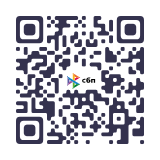

# Интеграция оплаты СБП — универсальная спецификация для агента-разработчика

> **Назначение:** один документ для встраивания **добровольного вознаграждения** за бесплатное ПО через **СБП (статический QR)**.  
> Подходит для **любого** приложения: web, PWA, Electron, mobile, CLI.  
> **Владелец:** ИП Вагин Илья Александрович · **Налоги:** УСН 6% «Доходы» · **Банк:** Альфа-Банк.

---

## 0. Инструкция агенту (прочитать первым)

1. В клиентское приложение **не встраивать** API банка и ключи кассы — только **публичные** URL и PNG QR.
2. Платёжная страница (`support.html` или аналог) может жить на **GitHub Pages / любом HTTPS-хостинге**.
3. ПО остаётся **бесплатным**; оплата **не блокирует** функции (paywall запрещён).
4. Текст для пользователя: **«Поддержать проект»**, не «донат».
5. Юридически это **оплата по публичной оферте** о праве использования ПО (сумма ≥ 1 ₽ на усмотрение пользователя).
6. До подключения **облачной кассы** не рекомендуется публично анонсировать QR (УСН 6% + физлица = чек обязателен).
7. В **RuStore / NashStore / Rumarket** — ссылку на оплату **не** в UI APK; только в описании карточки. В PWA/desktop — можно.

---

## 1. Константы владельца (копировать в проект)

```yaml
# Правообладатель
owner_name: "ИП Вагин Илья Александрович"
owner_name_full: "Вагин Илья Александрович"
ogrnip: "326774600424480"
inn: "772872195683"
email: "iliawagen@gmail.com"
phone: "+79150274902"

# Банк (Альфа-Банк)
bank_name: "АО «АЛЬФА-БАНК»"
account: "40802810302280007293"
currency: "RUR"
bik: "044525593"
corr_account: "30101810200000000593"

# СБП — статический QR, произвольная сумма
sbp_pay_url: "https://qr.nspk.ru/AS1A0073KULGI2489639NQM5QPNBUIOH"
sbp_qr_asset: "assets/sbp-qr.png"   # PNG из ЛК Альфа-Бизнес

# Назначение платежа (для UI и чеков)
payment_purpose: "Вознаграждение по оферте за ПО «{APP_NAME}»"
receipt_item_name: "Неисключительная лицензия на ПО «{APP_NAME}»"

# Налоги / фискализация
taxation: "УСН 6% доход"
fiscal_provider: "CloudKassir"       # облачная касса, регистрация в процессе
min_amount_rub: 1

# Юридические URL (шаблон — подставить домен приложения)
offer_url: "https://{YOUR_DOMAIN}/docs/offer.html"
support_url: "https://{YOUR_DOMAIN}/docs/support.html"
disclaimer_url: "https://{YOUR_DOMAIN}/docs/disclaimer.html"
privacy_url: "https://{YOUR_DOMAIN}/privacy.html"

# Пример (Мото ИЛС)
example_app_name: "Мото ИЛС"
example_base_url: "https://iliawagen-blip.github.io/moto-hud"
example_offer: "https://iliawagen-blip.github.io/moto-hud/docs/offer.html"
example_support: "https://iliawagen-blip.github.io/moto-hud/docs/support.html"
```

**Адрес регистрации ИП** в публичной оферте **не публикуется строкой** — формулировка: *«место нахождения — по данным ЕГРИП»*. Для банка/CloudKassir адрес указывается в их анкетах отдельно.

---

## 2. Почему СБП, а не эквайринг

| | **СБП (выбрано)** | **Интернет-эквайринг** |
|--|-------------------|------------------------|
| Комиссия | ~0,4–0,7% | ~2–3% |
| Интеграция | Статический QR + ссылка | Виджет, карты, PCI |
| Свободная сумма | ✅ «Любая» в QR | Неудобно |
| Сценарий | Добровольное вознаграждение | Фиксированная цена |

**Подключение в Альфе:** «СБП **без** эквайринга». Торговая точка: «{APP_NAME} онлайн», ОКВЭД **62.01**, канал «В интернете».

---

## 3. Юридический минимум (до приёма денег)

### 3.1. Обязательные документы

| Документ | Назначение |
|----------|------------|
| **Публичная оферта** | Договор лицензии со свободной ценой; акцепт = перевод СБП |
| **Отказ от ответственности** | Для **всех** пользователей (в т.ч. не плативших) — модалка при первом запуске |
| **Политика конфиденциальности** | Если собираете email для чека или телеметрию |

### 3.2. Оферта — обязательные пункты

- ИП, ОГРНИП, ИНН, email.
- ПО **бесплатно**; оплата **не расширяет** права.
- Вознаграждение ≥ **1 ₽**, сумму выбирает пользователь.
- Акцепт: скан QR / переход по ссылке СБП.
- **54-ФЗ:** кассовый чек при каждом платеже от физлица.
- **Раздел об ограничении ответственности** (для навигации/ПО — as is, не заменяет ПДД, нет ответственности за ДТП/штрафы).
- Возврат: заявление на email в течение 14 дней (исключительные случаи).
- Применимое право РФ.

### 3.3. Disclaimer при первом запуске (любое приложение)

```
localStorage ключ:  {app-id}-legal-consent
значение:           { "version": 1, "ts": "ISO-8601" }
при смене текста:   version++
```

Кнопки: «Не согласен, выйти» | «Я прочитал и согласен».  
Native app: decline → `exitApp()`. Browser: блокирующий экран.

---

## 4. Архитектура (универсальная)

```
┌─────────────────────────────────────────┐
│  Любое приложение (open source OK)      │
│  • константа SUPPORT_URL                │
│  • опционально: openExternal(url)       │
│  • опционально: PNG QR в About          │
│  • БЕЗ секретов                         │
└──────────────────┬──────────────────────┘
                   │ HTTPS
┌──────────────────▼──────────────────────┐
│  support.html на хостинге               │
│  • QR png + кнопка sbp_pay_url          │
│  • поле email (для чека)                │
│  • ссылка на offer.html                 │
└──────────────────┬──────────────────────┘
                   │ СБП
┌──────────────────▼──────────────────────┐
│  Альфа-Банк → р/с ИП                    │
└──────────────────┬──────────────────────┘
                   │ webhook (private backend)
┌──────────────────▼──────────────────────┐
│  CloudKassir → чек → ФНС + email        │
└─────────────────────────────────────────┘
```

**Backend (отдельный private repo, не в git приложения):**

```
POST /webhook/alfa-sbp   # проверка подписи, idempotency
→ CloudKassir API sell   # сумма, receipt_item_name, email?, УСН
```

До webhook: **ручные чеки** в ЛК CloudKassir (≤ 1 рабочий день после платежа).

---

## 5. Чеклист встраивания в приложение

### Шаг A — константы (публичные)

Создать файл, например `src/constants/support.ts` или `config/payment.json`:

```typescript
export const SUPPORT_URL = 'https://YOUR_DOMAIN/docs/support.html';
export const OFFER_URL = 'https://YOUR_DOMAIN/docs/offer.html';
export const SBP_PAY_URL = 'https://qr.nspk.ru/AS1A0073KULGI2489639NQM5QPNBUIOH';
export const SUPPORT_EMAIL = 'iliawagen@gmail.com';
```

### Шаг B — UI (выбрать 1+ мест)

| Место | Desktop | Mobile | Web |
|-------|---------|--------|-----|
| Settings → About | ✅ | ✅ | ✅ |
| Help / Справка | ✅ | ✅ | ✅ |
| README / `--support` | CLI | — | footer |

**Минимальная реализация:**

```typescript
// Electron
shell.openExternal(SUPPORT_URL);

// Browser / PWA
window.open(SUPPORT_URL, '_blank', 'noopener');

// Android Intent / Capacitor Browser
Browser.open({ url: SUPPORT_URL });
```

**Не делать:** WebView с формой карты, embedded API банка, проверка «оплатил ли user».

### Шаг C — страница support.html

Разместить на **HTTPS** (GitHub Pages, Cloudflare Pages, VPS).

**Обязательное содержимое:**

1. Заголовок «Поддержать {APP_NAME}».
2. Текст: ПО бесплатное, сумма на ваше усмотрение (от 1 ₽).
3. `` — QR из Альфы.
4. Кнопка `<a href="https://qr.nspk.ru/AS1A0073KULGI2489639NQM5QPNBUIOH">`.
5. Ссылка на **offer.html**.
6. Поле **email** (рекомендуется для чека).
7. Реквизиты (опционально, дублируют оферту).

**Минимальный JS (без backend):**

```javascript
document.getElementById('sbp-link')?.addEventListener('click', () => {
  const email = document.getElementById('receipt-email')?.value?.trim();
  if (email) {
    try { sessionStorage.setItem('{app-id}-receipt-email', email); } catch (_) {}
  }
});
```

### Шаг D — offer.html

Скопировать структуру из эталона `moto-hud/docs/offer.html`, заменить `{APP_NAME}` и URL.

### Шаг E — disclaimer

- Страница `disclaimer.html` + модалка первого запуска (см. §3.3).

### Шаг F — store builds

| Канал | Support в UI |
|-------|--------------|
| PWA, desktop, sideload APK | ✅ |
| RuStore, NashStore, Rumarket | ❌ в APK; URL в **описании** карточки |

---

## 6. HTML-шаблон support.html (скелет)

```html
<!DOCTYPE html>
<html lang="ru">
<head>
  <meta charset="UTF-8">
  <meta name="viewport" content="width=device-width, initial-scale=1">
  <title>{APP_NAME} — поддержать проект</title>
</head>
<body>
  <h1>Поддержать развитие «{APP_NAME}»</h1>
  <p>ПО бесплатное. Вознаграждение по <a href="offer.html">публичной оферте</a> (от 1 ₽).</p>

  <p><strong>ИП Вагин Илья Александрович</strong> · ИНН 772872195683</p>

  <figure>
    
    <figcaption>Отсканируйте в приложении банка</figcaption>
  </figure>

  <label>Email для чека <input type="email" id="receipt-email"></label>

  <p><a id="sbp-link" href="https://qr.nspk.ru/AS1A0073KULGI2489639NQM5QPNBUIOH"
        target="_blank" rel="noopener">Перейти к оплате СБП</a></p>

  <footer>
    <a href="offer.html">Оферта</a> ·
    <a href="disclaimer.html">Отказ от ответственности</a>
  </footer>
  <!-- script sessionStorage — см. §5C -->
</body>
</html>
```

---

## 7. Фискализация (CloudKassir + Альфа)

| Параметр | Значение |
|----------|----------|
| Система | **CloudKassir** (анкета: сайт = URL приложения на HTTPS) |
| Тариф | **Ежемесячный** (~3 500 ₽/мес) |
| СНО в кассе | УСН, доход, без НДС |
| Предмет чека | `Неисключительная лицензия на ПО «{APP_NAME}»` |
| Связка | Альфа-Бизнес → **Настройки ОФД** → CloudKassir |
| Срок чека | Не позднее **следующего рабочего дня** |

**Ручной режим (старт):** уведомление Альфы → ЛК CloudKassir → пробить чек → КУДиР.

**Авто (позже):** webhook в private backend.

---

## 8. Реквизиты для чека и UI (готовый блок)

```
Получатель:     ИП Вагин Илья Александрович
ИНН:            772872195683
ОГРНИП:         326774600424480
Р/с:            40802810302280007293 (RUR)
Банк:           АО «АЛЬФА-БАНК»
БИК:            044525593
К/с:            30101810200000000593
Назначение:     Вознаграждение по оферте за ПО «{APP_NAME}»
Контакт:        iliawagen@gmail.com
СБП:            https://qr.nspk.ru/AS1A0073KULGI2489639NQM5QPNBUIOH
```

---

## 9. Что нельзя (любое приложение)

- API-ключи Альфы / CloudKassir в репозитории или бинарнике.
- Paywall: функции только после оплаты.
- «Донат» / «пожертвование» в оферте, чеках, UI.
- Публичный QR **до** регистрации кассы в ФНС (технически QR уже работает — юридический риск).
- Кнопка оплаты в APK для RuStore/NashStore/Rumarket.
- Принимать от физлиц на УСН 6% **без** онлайн-кассы.

---

## 10. QA после интеграции

- [ ] `support.html` открывается по HTTPS без авторизации.
- [ ] QR-картинка загружается (не 404).
- [ ] Кнопка СБП ведёт на `qr.nspk.ru/AS1A0073KULGI2489639NQM5QPNBUIOH`.
- [ ] `offer.html` доступна, реквизиты совпадают с §8.
- [ ] Disclaimer: первый запуск → согласие → persist в localStorage.
- [ ] В приложении нет секретов в `git diff`.
- [ ] Store APK (если есть) — нет in-app pay button.
- [ ] Тестовый платёж 50 ₽ с **чужого** телефона + чек (после кассы).

---

## 11. Эталонная реализация (Мото ИЛС)

| Файл | Путь в repo |
|------|-------------|
| Оферта | `docs/offer.html` |
| Support + QR | `docs/support.html` |
| QR PNG | `docs/assets/sbp-qr.png` |
| Disclaimer page | `docs/disclaimer.html` |
| Consent modal | `js/legal-consent.js`, `index.html` |
| Handoff dev | `docs/HANDOFF-SBP-LEGAL.md` |

**Base URL:** https://iliawagen-blip.github.io/moto-hud/

---

## 12. Порядок работ (любой новый проект)

| # | Кто | Действие |
|---|-----|----------|
| 1 | Dev | Константы §1 → `support.ts` |
| 2 | Dev | `docs/offer.html` (из шаблона moto-hud, заменить APP_NAME) |
| 3 | Dev | `docs/support.html` + скопировать `sbp-qr.png` |
| 4 | Dev | Disclaimer modal + `disclaimer.html` |
| 5 | Dev | Ссылка «Поддержать» в Settings/Help |
| 6 | Dev | `privacy.html` если email |
| 7 | Dev | Deploy HTTPS |
| 8 | Owner | CloudKassir → ФНС → Альфа ОФД |
| 9 | Owner | Тест 50 ₽ + чек |
| 10 | Dev | Webhook (optional) |

---

## 13. Подстановка для нового приложения

Замените плейсхолдеры:

| Плейсхолдер | Пример |
|-------------|--------|
| `{APP_NAME}` | «Семейное древо», «Мото ИЛС» |
| `{YOUR_DOMAIN}` | `iliawagen-blip.github.io/my-app` |
| `{app-id}` | `family-tree`, `moto-hud` |

**Не менять** (общие для всех продуктов владельца): реквизиты §1, `sbp_pay_url`, email, CloudKassir — **один ИП, один QR можно использовать для всех продуктов** с разным `{APP_NAME}` в назначении/оферте **или** отдельный QR на продукт в ЛК Альфы (уточнить у банка).

> **Примечание:** один статический QR ведёт на р/с ИП — для нескольких продуктов достаточно **разных оферт** и указания продукта в назначении платежа / чеке. Отдельный QR на каждое приложение — опционально.

---

**Контакт владельца:** iliawagen@gmail.com · +7 915 027-49-02  
**Дата документа:** 2026-07-08
